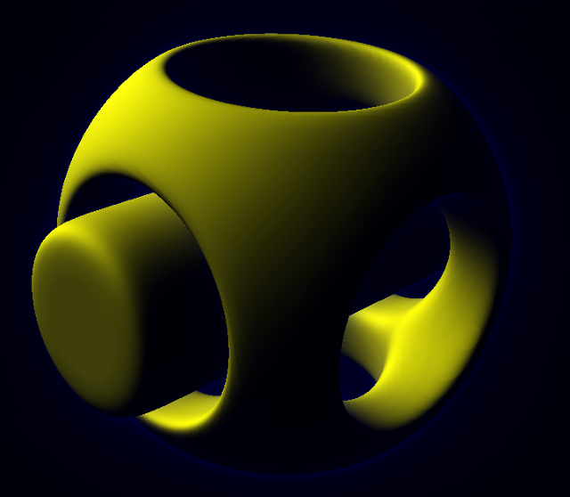
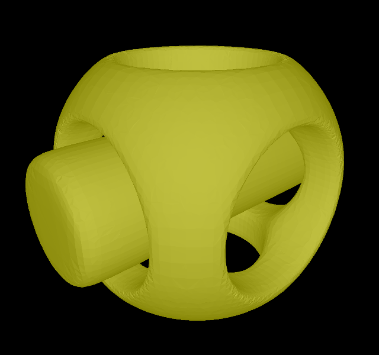

# truescad
Truescad is a script based CAD program similar to http://www.openscad.org/.
Similar to http://www.implicitcad.org/ Truescad uses implcit functions to represent geometry and hence offers very precise geometry.

In order to generate meshes, e.g. for 3D-printing, Truescad tessellates the geometry into a mesh with arbritrary precision.

Truescad offers rounded CSG, which allows for smooth and rounded looking objects.

Truescad is written in Rust.
